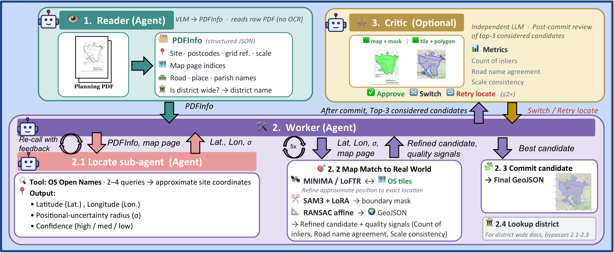

# Plan2Map / GeoPlanAgent

This repository is the official implementation of
[*Plan2Map: A Multimodal Benchmark for Document-Grounded Geospatial Boundary
Reconstruction from Planning Records*](https://arxiv.org/abs/2606.02747).

[**Paper**](https://arxiv.org/abs/2606.02747) ·
[**Project page**](https://odeb1.github.io/Plan2Map_Project_Page/) ·
**Dataset** (coming soon) ·
[**Model weights**](https://huggingface.co/fabiandegen/GeoPlanAgent)

<p align="center"></p>

Planning records often answer a spatial question: *which area is subject to a
particular rule?* UK Article 4 Directions describe the affected area through
legal notices and map plates rather than machine-readable geometry. Given only
the source planning document, a system must reconstruct a valid geospatial
boundary from notice text, schedules, map plates, map labels, and boundary
annotations.

**Plan2Map** contains 208 manually reviewed UK Article 4 Direction records,
spanning 1958–2025 and covering 29 local planning authorities across England.
Each case pairs a source planning PDF with a verified GeoJSON reference
boundary.

**GeoPlanAgent** is our document-grounded, geospatial-tool-in-the-loop
reference system. It decomposes the task into evidence extraction,
localisation, map registration, boundary segmentation, projection, and
verification, and reaches 0.736 mean IoU / 0.904 median IoU on the benchmark.

## Results

Main results of our GeoPlanAgent on Plan2Map (the paper's Table 1). The VLM-direct baselines read
the PDF and emit GeoJSON in a single call, no tools; the 40-case rows use a
stratified subset (done to safe API costs).

| Model | N | %IoU>0 | Mean IoU | Median IoU | %IoU≥0.8 | Err (m) | Acc@0.1D | $/doc | s/case |
|---|---|---|---|---|---|---|---|---|---|
| Gemini-3-Flash (VLM-direct) | 40 | 30.0% | 0.053 | 0.000 | 0.0% | 920 | 2.5% | 0.003 | 5 |
| Gemini-3.1-Pro (VLM-direct) | 40 | 42.5% | 0.112 | 0.000 | 0.0% | 490 | 7.5% | 0.108 | 75 |
| Claude-Opus-4.7 (VLM-direct) | 40 | 22.5% | 0.044 | 0.000 | 0.0% | 1131 | 0.0% | 0.059 | 7 |
| GPT-5.5-Pro (VLM-direct) | 40 | 50.0% | 0.106 | 0.005 | 0.0% | 386 | 10.0% | 2.855 | 650 |
| **GeoPlanAgent** | 40 | 85.0% | 0.721 | 0.901 | 67.5% | 6.7 | 80.0% | 0.043 | 162 |
| Gemini-3.1-Pro (VLM-direct) | 208 | 40.4% | 0.108 | 0.000 | 1.4% | 480 | 9.6% | 0.106 | 75 |
| **GeoPlanAgent** | 208 | 89.4% | **0.736** | **0.904** | **67.8%** | **4.6** | **78.8%** | 0.043 | 153 |
| **GeoPlanAgent + Critic** | 208 | 89.9% | **0.740** | **0.906** | **67.8%** | **4.6** | **78.8%** | 0.045 | 155 |

## Repository layout

```
GeoPlanAgent/
├── benchmark_runner.py        # Evaluation driver across the dataset
├── geoplanagent/              # The pipeline (see geoplanagent/README.md)
│   ├── agents/                #   Reader, Locate sub-agent, Worker, Critic
│   └── tools/                 #   PDF, tiles, geocoding, matching, SAM3, rotation
├── MINIMA/                    # Vendored MINIMA-LoFTR matcher (Apache-2.0)
├── models/                    # Case→fold routing map; weights download here (Setup step 4)
├── training/                  # SAM3-LoRA + rotation training/eval (see training/README.md)
├── ablations/                 # Paper ablation drivers (see ablations/README.md)
├── scripts/                   # compute_tables.py, compute_figures.py, utilities
├── figures/                   # Paper figures (Figures 3–4 regenerable via compute_figures.py)
├── data/                      # The 208-case dataset (not tracked; see Setup step 6)
├── os_opendata/               # OS OpenData (not tracked; fetched by setup script)
└── results/                   # Run outputs (not tracked; regenerable)
```

## Setup

Requirements: Python 3.10+ (managed via `uv`), and macOS with MPS or Linux
with CUDA for GPU acceleration. Budget ~24 GB of disk for the full setup
(~14 GB without wanting to run ablations).

**1. Install**

macOS:

```bash
brew install uv
uv sync
```

Linux (or macOS without Homebrew):

```bash
curl -LsSf https://astral.sh/uv/install.sh | sh
uv sync
```

**2. Configure**

```bash
cp .env.template .env
```

Then open `.env` and fill in your keys:

| Variable | Required | Purpose |
|---|---|---|
| `OPENROUTER_API_KEY` | yes | LLM access via OpenRouter |
| `HF_TOKEN` | yes | HuggingFace — SAM3 base-weight download on first run |

SAM3 is a gated model: accept Meta's SAM License once at
[facebook/sam3](https://huggingface.co/facebook/sam3), after which the base
weights (~3 GB) download automatically on first run.

**3. MINIMA checkpoint** — the matcher code is vendored; the LoFTR checkpoint
is fetched separately:

```bash
cd MINIMA/weights && bash download.sh && cd ../..
```

**4. Fine-tuned weights** — the SAM3-LoRA adapters (5 folds × 76 MB, PEFT
format) and rotation-classifier checkpoints (5 folds × 94 MB) are downloaded
from [fabiandegen/GeoPlanAgent](https://huggingface.co/fabiandegen/GeoPlanAgent)
straight into `models/` (run from the repository root):

```bash
hf download fabiandegen/GeoPlanAgent --include "sam3_lora/*" "rotation_classifier_kfold/*" --local-dir models
```

**5. OS OpenData** — one script fetches and unpacks everything the pipeline
reads (all five products are OS OpenData under OGL v3: free, no API key,
no rate limit):

```bash
uv run scripts/setup_os_opendata.py              # everything (~19 GB)
uv run scripts/setup_os_opendata.py --main-only  # just what the main pipeline needs
```

**6. Dataset** — download the 208 benchmark cases from (TBA) and the metadata
spreadsheet from (TBA), both into a folder named `data/`:

```
data/
├── 0_planning_dataset_list.xlsx   # per-case metadata labels
└── <case>/                        # one folder per case
    ├── <document>.pdf             # the planning record the pipeline reads
    └── <boundary>.geojson         # ground-truth boundary, used only for scoring
```

You only need the spreadsheet to reproduce Figure 4, the by-attribute
breakdown: it holds each case's document-colour, scan-quality, and
shape-complexity labels, which `scripts/compute_tables.py` and
`scripts/compute_figures.py` read. It is not needed to run the benchmark itself.

**7. Boundary annotations** (optional — only needed to re-evaluate or re-train
the segmentation and rotation models) — download the 211 hand-annotated
map-page masks from TBA into `boundary_annotations/`, then assemble the
training set from them:

```bash
uv run training/build_sam3_training_set.py
```

## Reproducing our results

Note that due to stochasticity when using LLMs, when you rerun this code you will not get 
the very exact numbers as we got, but they will be very close. Furthermore, since this involves
calling the OpenRouter API, this will cost money, and some models like GPT-5.5 Pro are very expensive
to run per document (~2.8$/doc).

**1. Main benchmark.** Feeds Table 1's GeoPlanAgent and + Critic rows,
Table 2's full-pipeline row, and Figure 4:

```bash
uv run benchmark_runner.py --model gemini-flash --enable-critic --output-dir results/main_pipeline
```

**2. VLM end-to-end baselines — Table 1's upper rows.** One run per model on
the 40-case subset, plus Gemini-3.1-Pro on the full 208 cases:

```bash
uv run python ablations/vlm_e2e_pdf_to_geojson.py --vlm-model <alias> --subset
uv run python ablations/vlm_e2e_pdf_to_geojson.py --vlm-model gemini-pro
```

**3. Locate ablations — Table 2's isolated-locate rows:**

```bash
uv run python ablations/locate_only_eval.py              # only the tool the actual Locate sub-agent uses
uv run python ablations/locate_only_eval.py --all-tools  # additional 5 tools for the Locate sub-agent
uv run python ablations/locate_vlm_direct.py             # single-shot VLM geocoding
```

**4. Segmentation ablations — Figure 3 and Table 12.** The vanilla-SAM prompt
sweep is offline and free; the VLM-direct segmentation rows call the API.
(Figure 3's SAM3-LoRA bar additionally needs step 6's predictions.)

```bash
uv run python ablations/sam_base_prompt_search.py
uv run python ablations/vlm_segmentation.py --model gemini-flash
uv run python ablations/vlm_segmentation.py --model gemini-pro
```

**5. Collapsed-reader ablation — optional Table 1 row:**

```bash
uv run benchmark_runner.py --no-reader --model gemini-flash --output-dir results/ablations/no_reader
```

**6. Segmentation (Table 11) — offline, no API cost.** Evaluates our
fine-tuned SAM3-LoRA against the hand-annotated boundary masks:

```bash
uv run training/eval/eval_sam_kfold.py
uv run scripts/compute_tables.py table11
```

**7. Rotation (Table 9) — offline, no API cost.** Evaluates the
map-orientation classifier, with and without test-time augmentation:

```bash
uv run training/eval/eval_rotation_kfold.py
uv run training/eval/eval_rotation_kfold.py --tta
uv run scripts/compute_tables.py table9
```

**8. Aggregate.** Every table and figure recomputes from whatever runs are on
disk:

```bash
uv run scripts/compute_tables.py     # all sections, or specific sections: table1 fig4 ...
uv run scripts/compute_figures.py    # renders Figures 3 and 4 as PDFs
```

## Running your own documents

The pipeline isn't tied to the benchmark — any UK planning PDF works. Create
one folder per document (the folder name becomes the case name), drop the PDF
in, and point the runner at it:

```bash
mkdir -p my_cases/some_site
cp /path/to/planning_document.pdf my_cases/some_site/
uv run benchmark_runner.py --model gemini-flash --eval-dir my_cases --output-dir results/my_run
```

The predicted boundary lands in
`results/my_run/gemini-flash/some_site/predicted.geojson` (a GeoJSON Feature,
WGS84). Without a ground-truth `.geojson` in the case folder the scores in
`metrics.json` are meaningless, but the prediction itself is unaffected. To
look at it on a map:

```bash
uv run scripts/visualize_case.py --run-dir results/my_run/gemini-flash --case some_site --eval-dir my_cases
```

Documents must be UK planning records — localisation and map registration run
against Ordnance Survey Great-Britain data. `uv run benchmark_runner.py --help`
lists the remaining knobs (enabling critic, request budget, DPI).

## Licences and attribution

- **Code** is MIT-licensed (see [LICENSE](LICENSE)).
- The **SAM3-LoRA adapters** are fine-tuned from Meta's SAM 3, so Meta's
  [SAM License](https://huggingface.co/facebook/sam3/blob/main/LICENSE)
  applies to them rather than this repository's MIT licence. The HuggingFace
  repo hosting them includes the licence text.
- **MINIMA** ([LSXI7/MINIMA](https://github.com/LSXI7/MINIMA)) is vendored
  under Apache-2.0, trimmed to the LoFTR matcher.
- Contains OS data © Crown copyright and database right 2026. Contains Royal Mail data © Royal Mail copyright and database right 2026. Contains National Statistics data © Crown    copyright and database right 2026. Source planning documents and reference GeoJSON boundaries are reproduced from [planning.data.gov.uk](https://www.planning.data.gov.uk) under the Open Government Licence v3.0.
  [Open Government Licence v3.0](https://www.nationalarchives.gov.uk/doc/open-government-licence/version/3/).

## Citation

```bibtex
@misc{Plan2Map2026,
      title={Plan2Map: A Multimodal Benchmark for Document-Grounded Geospatial Boundary Reconstruction from Planning Records}, 
      author={Fabian Degen and Oishi Deb and Jindong Gu and Junchi Yu and Samuele Marro and Philip Torr and Jialin Yu},
      year={2026},
      eprint={2606.02747},
      archivePrefix={arXiv},
      primaryClass={cs.CV},
      url={https://arxiv.org/abs/2606.02747},
}
```
